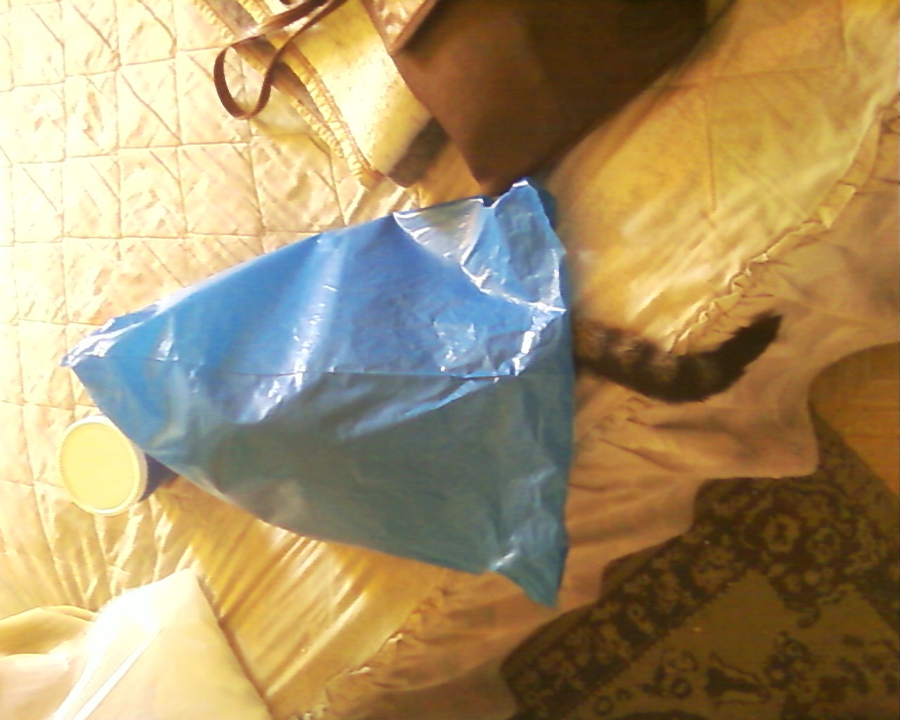

# Clase 3

Resetear git add's

```sh
git reset
```

Archivo *.gitignore* permite evitar que se suban archivos al hacer push o los borra en el siguiente push

```sh
*.txt
```

Antes de agregar al stage muestra todos los cambios por separado y permite elegir que se pasa a stage y que no

```sh
git add --patch
```

Quitar vinculo del repo local con el remoto

```sh
git remove origin
```

Imagen en Markdown:

